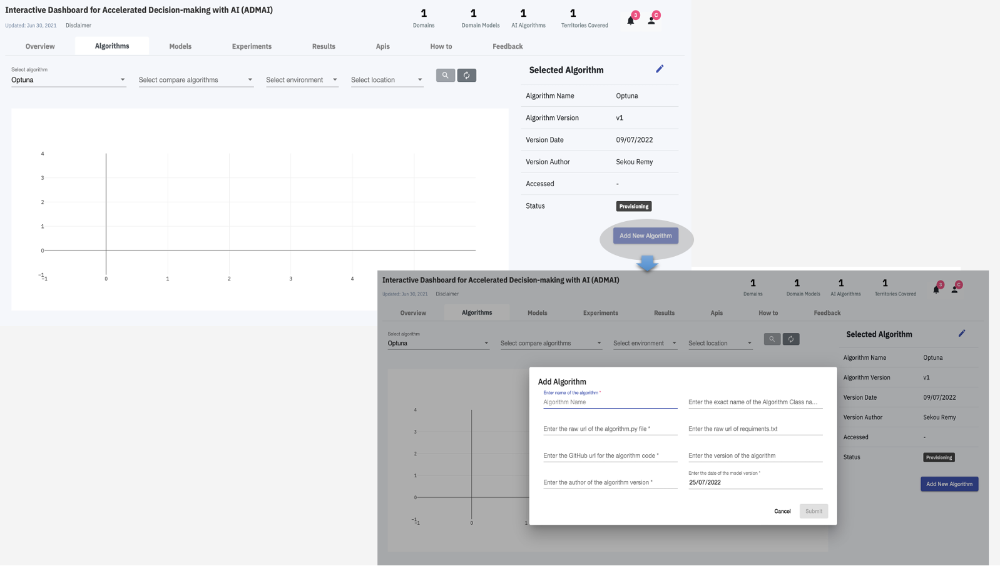
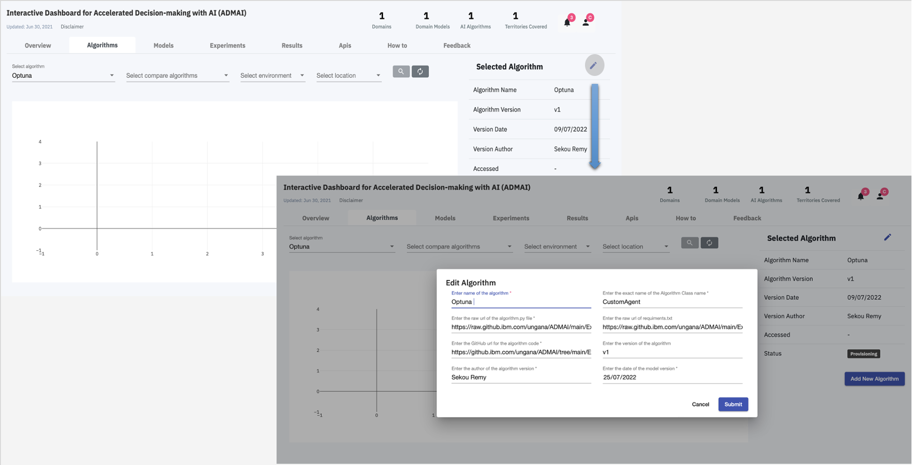

<PageDescription>

On the [Algorithms](../overview/algorithms) Tab of the Dashboard, a user can:
<AnchorLinks>
  <AnchorLink>Add a new Algorithm</AnchorLink> 
  <AnchorLink>Edit an existing algorithm </AnchorLink> 
</AnchorLinks>

</PageDescription>

## Add a new Algorithm
In order to add a new algorithm the following configurations need to be completely filled

| Algorithm configurations | Description | 
| ----------------------------------------------------- | --------------------------------------------------------| 
| `name` : Enter name of the algorithm | Preferred name of algorithm | 
| `algorithm class name` : Enter the exact name of the Algorithm Class Name | Class name in the algorithm code   |  
| `requirements.txt` : Enter the raw url of the requirements.txt | Path that links directly to the raw requirements.txt file    | 
| `algorithm.py (RAW URL)` : Enter the raw url of the algorithm.py file | Path that links directly to the raw algorithm.py file    |  
| `algorithm.py (GITHUB URL)`: Enter the Github url for the algorithm code | Path that links directly to the algorithm.py file in the Github repository    |  
| `version` : Enter the version of the algorithm | Current version of the selected algorithm     |         
| `author` : Enter the author of the algorithm version | Author of the current version of the algorithm     |  
| `date` : Enter the date of the algorithm version | Date of algorithm version  |  

Click `Submit` to Add a new algorithm

The `Add a new algorithm` section is as shown below :
<ImageGalleryImage alt="Add a new algorithm" title="Add a new algorithm" col={10}>

</ImageGalleryImage>

## Edit an existing algorithm

Similar to `Add a new algorithm`, `Edit an existing algorithm` has the same configurations.

Therefore, in order to edit an existing algorithm, the user can make changes to the algorithm configurations of your their choice and then click `Submit` 

<ImageGalleryImage alt="Edit an existing algorithm" title="Edit an existing algorithm" col={10}>

</ImageGalleryImage>
