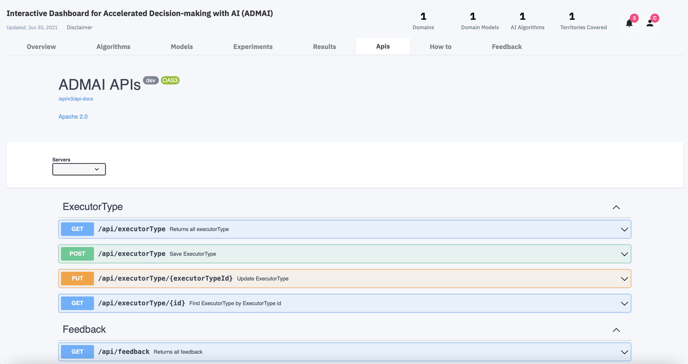

<PageDescription>

Apis stand for Application Programming Interfaces

The Apis tab on the Dashboard is designed for developers and artificial intelligence practitioners as it provides a library/module which exposes the microservices for their AI algorithms to consume.

The endpoints on this page include:

 `Executor Type`, `Feedback`, `Experiment Output`, `Favourite`,`Results Request`, `Algorithm`,`Execution Environment`, `Location Data`, `Location Data Controller`, `Executor`, `Experiment`, `Blockchain TaskEvents`, `Execution Environment Command`, `Data Repository Configurations`, `Location`

<ImageGalleryImage alt="Apis Landing Page" title="Apis Landing Page" col={15}>

</ImageGalleryImage>

</PageDescription>

 