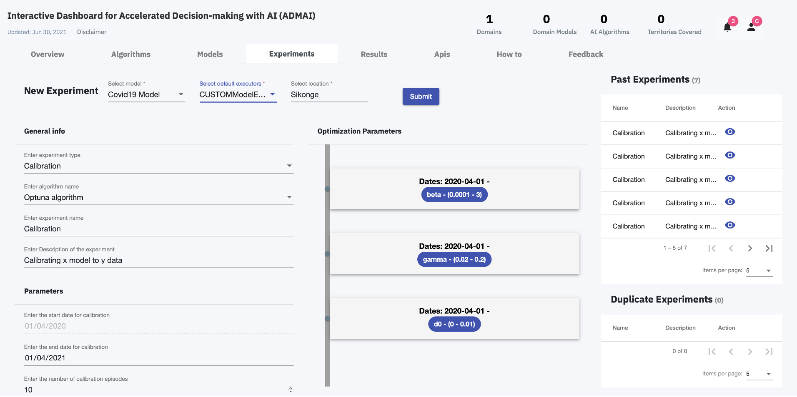

<PageDescription>

On the Experiments Tab of the Dashboard, a user can:
<AnchorLinks>
  <AnchorLink>Submit a new Experiment</AnchorLink> 
  <AnchorLink>View past experiments </AnchorLink> 
  <AnchorLink>View dupicate experiments experiments </AnchorLink> 
</AnchorLinks>

The Experiments page is as shown below:
<ImageGalleryImage alt="Experiments Page" title="Experiments Page" col={15}>

</ImageGalleryImage>
</PageDescription>

## Submit a new Experiment
After the starting a model experiment, the parameters needed to submit a new experiment are auto populated. 

The user can then click `Submit` to add a new experiment.
## View past experiments 
A list of the previous experiments executed by the current user are displayed.
## View dupicate experiments 
As there is no coordination between these independent experimental environments prior to running the experiment, there is a possibility of having duplicate experiments.

The list of duplicate experiments are displayed on this page 