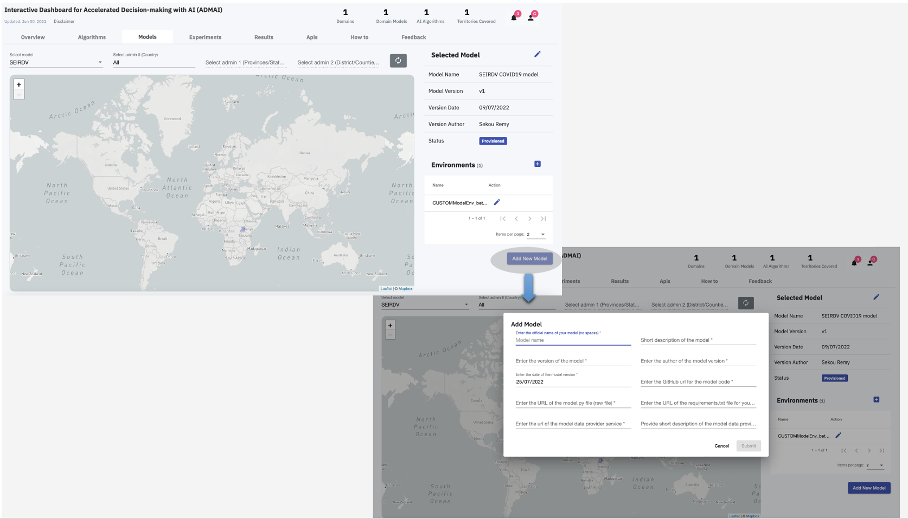
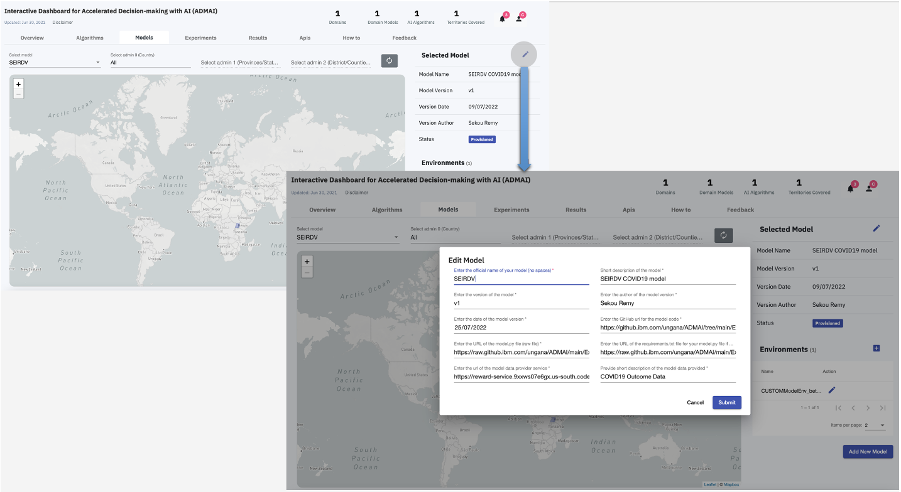
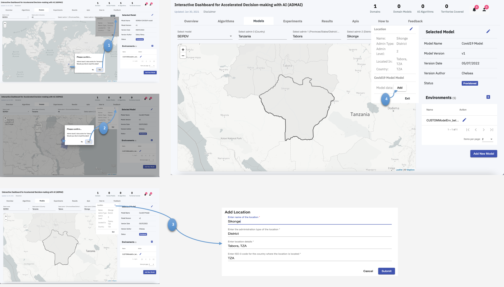
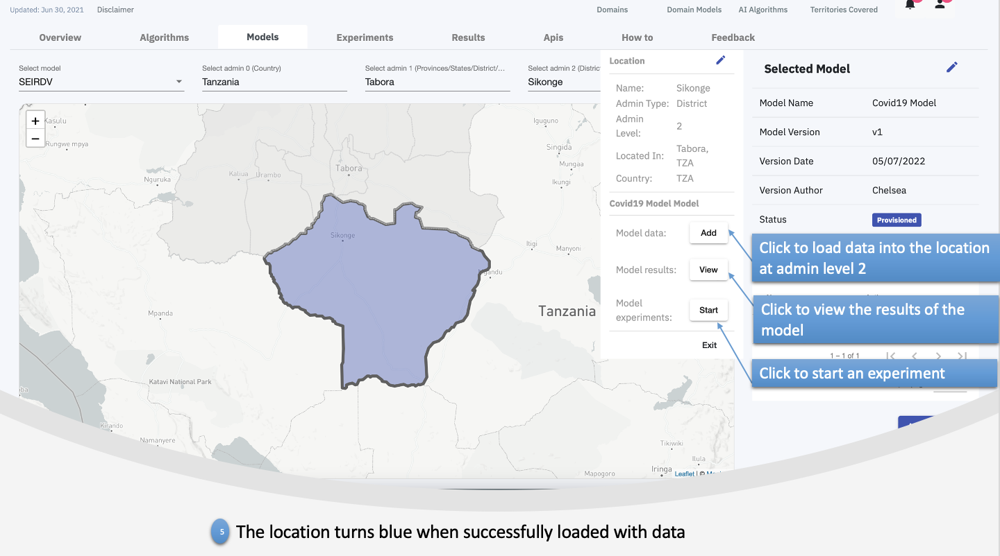
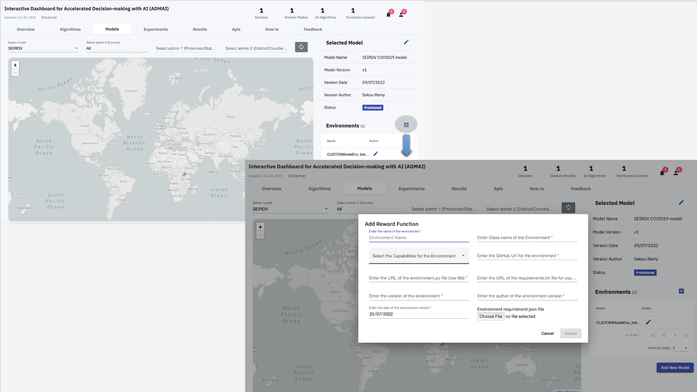
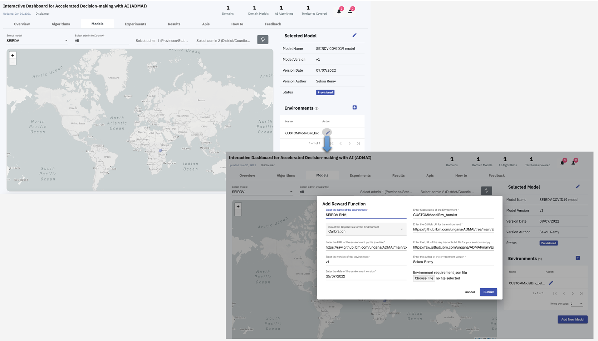

<PageDescription>

On [Models](../overview/models) Tab of the Dashboard, a user can:
<AnchorLinks>
  <AnchorLink>Add a new Model</AnchorLink> 
  <AnchorLink>Edit an existing model </AnchorLink> 
  <AnchorLink>Onboard locations at different admin levels </AnchorLink> 
  <AnchorLink>Add a new Environment</AnchorLink> 
  <AnchorLink>Edit an existing Environment</AnchorLink> 
</AnchorLinks>

</PageDescription>

## Add a new Model

In order to add a new model the following configurations need to be completely filled

| Model configurations | Description | 
| ----------------------------------------------------- | --------------------------------------------------------| 
| `name` : Enter official name of your model | Preferred name of the model | 
| `model description` : Short description of the model | Description of what the model does   |  
| `model version` : Enter version of the model | Version of the model   | 
| `version author` : Enter the author of the model version  | Author of the current model version   |  
| `date`: Enter the date of the model version | Date of the model version |  
| `model.py (GITHUB URL)` : Enter the Github url for the model code | Path that links directly to the model.py file in the Github repository  |         
| `model.py (RAW URL)` : Enter the URL of the model.py file (raw file)| Path that links directly to the raw model.py file   |  
| `requirements.txt` : Enter the URL of the requirements.txt file for your model.py | Path that links directly to the raw requirements.txt file   |  
| `model data provider service` : Enter the URL of the requirements.txt file for your model.py | Path that directly link to the service that provides data to the model   | 
| `model data description` : Enter the URL of the requirements.txt file for your model.py | Description of the data added to the model   | 

Click `Submit` to Add a new model

The Add a new model section is as shown below :
<ImageGalleryImage alt="Add a new model" title="Add a new model" col={10}>

</ImageGalleryImage>

## Edit an existing model

Similar to `Add Model`, `Edit Model` has the same configurations.

Therefore, in order to edit an existing model, the user can make changes to the model configurations of your their choice and then click `Submit` 

<ImageGalleryImage alt="Edit an existing model" title="Edit an existing model" col={10}>

</ImageGalleryImage>

## Onboard locations at different admin levels

| Admin Levels | Description | 
| ----------------------------------- | --------------------------------------| 
| `0`| Country | 
| `1`| Provinces/States/County  |  
| `2`| District/Constituencies | 

To onboard locations at different admin levels,

Click on the country of your choice on the regional map 

If the region is color coded, that means that data has been loaded to the location, therefore you can start a new experiment or choose to view the model results

If not, add the location, load data into the location then proceed to start a new experiment or view the model results.

The same can be done to onboard locations at different admin levels

Click on the province/constituency of your choice, add the location, add data to the location then proceed to either start a new experiment or view the model results

<ImageGalleryImage alt="Steps to onboard locations at different admin levels" title="Steps to onboard locations at different admin levels" col={10}>

</ImageGalleryImage>

<ImageGalleryImage alt="Steps to onboard locations at different admin levels" title="Steps to onboard locations at different admin levels" col={10}>

</ImageGalleryImage>

## Add a new [Environment](../overview/environment)

In order to add a new environment the following configurations need to be completely filled

| Environment configurations | Description | 
| ----------------------------------------------------- | --------------------------------------------------------| 
| `name` : Enter name of the environment | Preferred name of the environment | 
| `environment class name` : Enter Class Name of the Environment | Class name in the environment code   |  
| `capability` : Select the Capabilities for the Environment | From the drop down select either the calibrations or prediction capability |  
| `requirements.txt` : Enter the raw url of the requirements.txt | Path that links directly to the raw requirements.txt file    | 
| `environment.py (RAW URL)` : Enter the raw url of the environment.py file | Path that links directly to the raw environment.py file    |  
| `environment.py (GITHUB URL)`: Enter the Github url for the environment code | Path that links directly to the environment.py file in the Github repository    |  
| `version` : Enter the version of the environment | Current version of the environment     |         
| `author` : Enter the author of the environment version | Author of the current version of the environment     |  
| `date` : Enter the date of the environment version | Date of environment version  |  
| `environment.json` | Upload the environment.json file  |  

Click `Submit` to Add a new environment

The Add a new environment section is as shown below :

<ImageGalleryImage alt="Add a new Environment" title="Add a new Environment" col={10}>

</ImageGalleryImage>

## Edit an existing [Environment](../overview/environment)

Similar to `Add a new Environment`, `Edit an existing environment` has the same configurations.

Therefore, in order to edit an existing environment, the user can make changes to the environment configurations of your their choice and then click `Submit` 
<ImageGalleryImage alt="Edit an existing Environment" title="Edit an existing Environment" col={10}>

</ImageGalleryImage>
