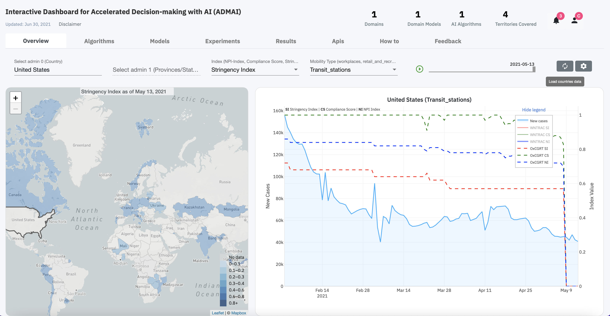

<PageDescription>
 
 The Overview tab of the Dashboard gives a comprehensive view of the entire Covid 19 domain using a regional map and a time series graph.

<ImageGalleryImage alt="ADMAI Landing Page" title="ADMAI Landing Page" col={15}>

</ImageGalleryImage>

The user is therefore able to: 

<AnchorLinks>
  <AnchorLink>Drill deep to understand the index and mobility type of each country</AnchorLink> 
  <AnchorLink>Select time scales to visualize </AnchorLink> 
  <AnchorLink>Select the data to visualize </AnchorLink> 
  <AnchorLink>Playback the drop or rise of the Covid 19 cases over time </AnchorLink> 
</AnchorLinks>

</PageDescription>

## Drill deep to understand the index and mobility type of each country
The NPI-Index,Compliance Score and the Stringency Index imposed on the different mobility types(Transit stations, Retail and recreation, Grocery and pharmacy, Parks and Workplaces) in different countries can be clearly observed

## Select time scales to visualize
For a more focused analysis, the user can choose to visualize the new Covid 19 cases at a particular time or over a certain period of time

## Select the data to visualize
The time series graph, allows for visualization of a specific dataset.

The regional map, on the other hand, gives insights on the amount of data present for a specific region given a certain index and mobility type.

## Playback the drop or rise of the Covid 19 cases over time 
Clicking the `Play` button allows for visualization of the changes in the Covid 19 cases over time

