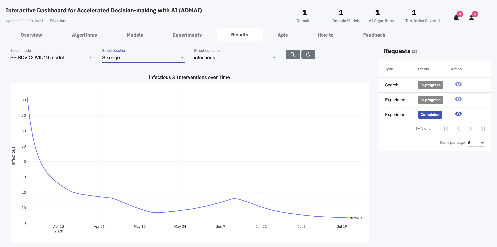

<PageDescription>

The Results page shows all the result requests that have been made and the status of each request.

On the completion of a certain result request, a response is sent and the user can visualize the results of the experiment

<ImageGalleryImage alt="Results Page" title="Results Page" col={15}>

</ImageGalleryImage>

</PageDescription>