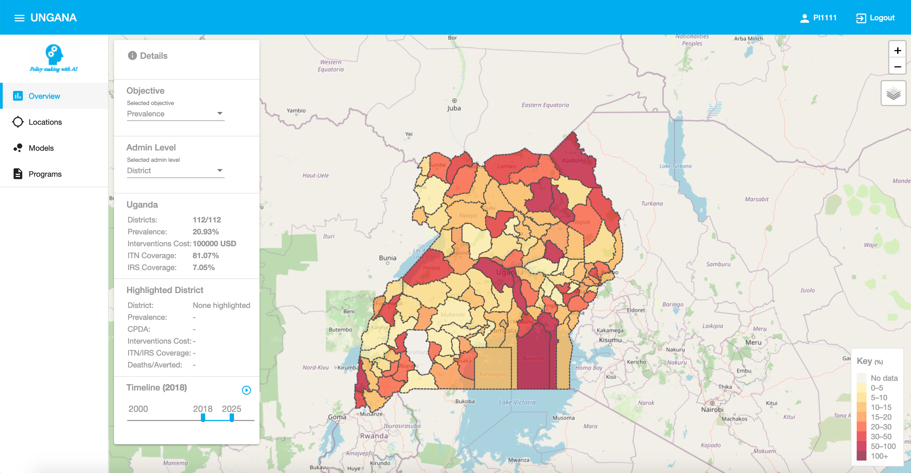

import { OutboundLink } from "gatsby-plugin-google-analytics";

<Row>
<Column colMd={5} colLg={8}>

<PageDescription>

Data Browser

</PageDescription>

</Column>

<Column colMd={2} colLg={3} offsetMd={1} offsetLg={1}>
<Aside aria-label="Link aside">

**Dashboard <OutboundLink href="https://admai-dashboard.9xxws07e6gx.us-south.codeengine.appdomain.cloud/" rel="nofollow noopener noreferrer" target="_blank">this link</OutboundLink> **

</Aside>

</Column>
</Row>

<Row className="image-card-group">
<Column colMd={8} colLg={8}>
<ImageCard href="https://admai-dashboard.9xxws07e6gx.us-south.codeengine.appdomain.cloud/" aspectRatio="2:1">

</ImageCard>
</Column>
</Row>

<PageDescription>

Data Browser video

</PageDescription>

<Title> Visualizations</Title>

<Video title="Carbon homepage video" vimeoId="359578263" />
<Caption fullWidth>
  A video highlighting accelerated decision making with AI tool's key
  visualizations.
</Caption>
